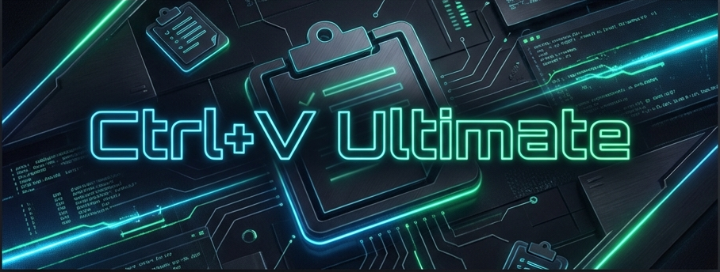
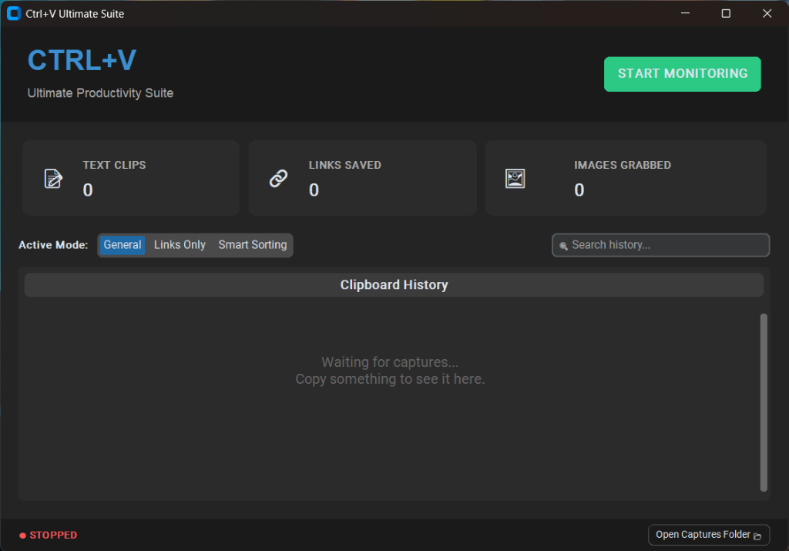

# Ctrl+V Ultimate Productivity Suite



> **A premium clipboard management tool designed to boost productivity by automatically organizing text, links, and images.**

Created by **ArushSengar**

---

## 📋 Table of Contents

- [Overview](#overview)
- [Features](#features)
- [Screenshots](#screenshots)
- [Installation](#installation)
- [Usage](#usage)
- [System Requirements](#system-requirements)
- [How It Works](#how-it-works)
- [Troubleshooting](#troubleshooting)
- [License](#license)
- [Author](#author)

---

## 🎯 Overview

Ctrl+V Ultimate is a comprehensive Windows application designed to streamline your workflow by solving common clipboard limitations:
- Losing copied text or links
- Manually saving images from the clipboard
- Disorganized clipboard history
- Needing to categorize links vs. notes

This tool provides a silent background monitor with a premium "Hero" dashboard interface.

---

## ✨ Features

### Smart Clipboard Management
- **🔗 Smart Sorting** - Automatically detects URLs and saves them to `links.txt`, while keeping plain text in `text_history.txt`.
- **�️ Image Capture** - Instantly detects copied images and saves them as PNGs to a local `captures/` folder.
- **📝 Searchable History** - Real-time Regex-powered search bar to filter through your clipboard history.

### User Interface & Experience
- **🎨 Modern Dark Theme** - Built with `CustomTkinter` for a sleek, professional aesthetic.
- **👻 System Tray Integration** - Minimizes silently to the notification area to keep your taskbar clean.
- **� Real-time Dashboard** - "Hero" style header with live statistics for text, links, and image counts.

### Quick Actions
- **⚡ One-Click Start/Stop** - Toggle monitoring instantly.
- **📂 Instant Access** - Open your captures folder with a single click.
- **🖱️ Segmented Controls** - Switch modes (General | Links Only | Smart Sorting) effortlessly.

---

## 📸 Screenshots

### Hero Dashboard

*The main interface showing the Hero header, stat cards, and smart segments*

*(Note: Add your screenshots to the `assets/` folder)*

---

## 💾 Installation

### Option 1: Download Executable (Recommended)
1. Go to the `dist` folder in this repository.
2. Download `CtrlV_Ultimate.exe`.
3. Run the executable. **No Python installation required.**

### Option 2: Run from Source
1. Clone this repository:
   ```bash
   git clone https://github.com/ArushSengar/ctrl-v-ultimate.git
   cd ctrl-v-ultimate
   ```

2. Install Python 3.12 or higher.

3. Install required dependencies:
   ```bash
   pip install customtkinter pystray Pillow pyperclip
   ```

4. Run the application:
   ```bash
   python app.py
   ```

---

## 🎮 Usage

### First Time Setup
1. **Launch the App** - Run `CtrlV_Ultimate.exe`.
2. **Select Mode** - Choose between "General", "Links Only", or "Smart Sorting".
3. **Start Monitoring** - Click the large green "START MONITORING" button.

### System Tray
1. Click the **X** or minimize button to send the app to the tray.
2. The app continues running in the background.
3. **Right-click** the tray icon to "Show" or "Exit".

### Accessing Data
1. Click the **"Open Captures Folder 📂"** button in the footer.
2. You will find:
   - `clipboard_history.txt` (General clips)
   - `links.txt` & `text_history.txt` (Smart Sorted)
   - `captures/` folder (Images)

---

## 💻 System Requirements

- **Operating System**: Windows 10/11 (64-bit)
- **Python** (if running from source): Python 3.12+
- **RAM**: Minimal impact (<50MB)

---

## 🔧 How It Works

### Clipboard Polling
The tool runs a background thread that checks the clipboard every 1 second.
- It compares the current clipboard content hash against the last known hash.
- **Text** is parsed using Regex to determine if it's a URL.
- **Images** are grabbed via `ImageGrab` and timestamped.

### File Handling
- All data is stored locally.
- Text allows are appended with a timestamp `[HH:MM:SS]`.
- Image filenames use the format `img_YYYYMMDD_HHMMSS.png`.

---

## 🐛 Troubleshooting

### "ModuleNotFoundError"
- If running from source, ensure you installed `requirements.txt`.
- If using the `.exe`, ensure you haven't deleted the internal folder (if not using the single-file version).

### App doesn't capture copies
- Check if "START MONITORING" is active (Green badge).
- Some secure apps (like banking software) block clipboard reading.

---

## � License

This software is **free to use** for personal and commercial purposes.

**Terms:**
- ✅ Free to download and use
- ✅ Free to modify for personal use
- ❌ No warranty provided - use at your own risk

See [LICENSE](LICENSE) for full details.

---

## 👤 Author

**ArushSengar**

- GitHub: [@ArushSengar](https://github.com/ArushSengar)
- Created: 2026

---

## 🌟 Support

If this tool boosted your productivity, consider:
- ⭐ Starring this repository
- 🐛 Reporting bugs in Issues
- 📢 Sharing with friends

---

**Made with ❤️ for Power Users**
